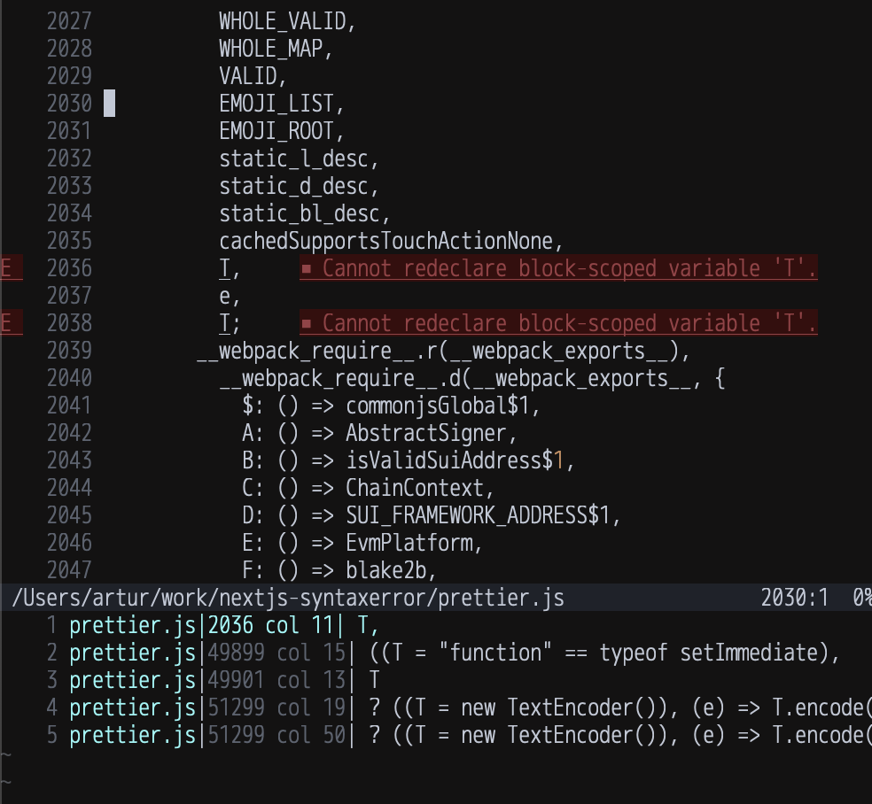

# SWC minification bug

This repo reliably reproduces what seems to be a bug with SWC minifcation. It's a default `create-next-app` bootstrapped project, with `@wormhole-foundation/wormhole-connect` imported.

SWC fails to minify Wormhole Connect and produces a syntax error. Simply run `npm install` then `npm run build` and you will see this output:

```
> next build

   ▲ Next.js 15.1.1

   Creating an optimized production build ...
 ✓ Compiled successfully
 ✓ Linting and checking validity of types
   Collecting page data  ..SyntaxError: Identifier 'T' has already been declared
    at <unknown> (.next/server/app/page.js:1)

> Build error occurred
```

There are two hoisted variables `T`. I ran this chunk through `prettier` and used tree-sitter to find where `T` is referenced
and there are two places, both coming from `axios`:



The corresponding source code is here:

https://github.com/axios/axios/blob/db44d339f03f041571ea01b09a4c03b28bbe7abe/lib/adapters/fetch.js#L16

https://github.com/axios/axios/blob/db44d339f03f041571ea01b09a4c03b28bbe7abe/lib/utils.js#L680-L695

In both cases, functions are being called with unnamed parameters and SWC appears to assign these params to a name `T` in the same scope! This leads to a syntax error.

This looks like a bug with how SWC handles unnamed parameters.
